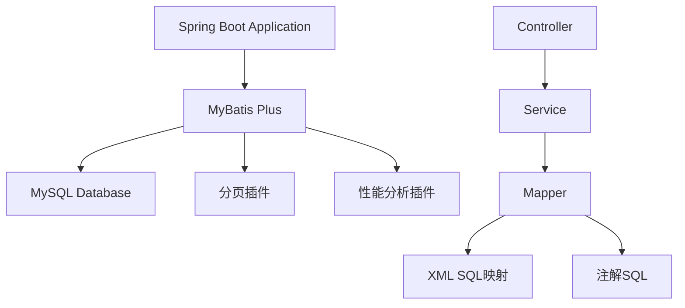

# 设计文档

## 1. 技术架构

### 1.1 技术选择
- 后端技术栈: Spring Boot 3 + MyBatis Plus 3.5.x
- 数据存储: MySQL 8.0 (保持不变)
- 构建工具: Maven (保持不变)
- 部署环境: 与现有环境保持一致

### 1.2 系统架构


## 2. 详细设计

### 2.1 MyBatis Plus 集成设计

#### 2.1.1 依赖配置
- 移除 `spring-boot-starter-data-jpa`
- 添加 `mybatis-plus-boot-starter` 依赖
- 保留 MySQL 驱动依赖

#### 2.1.2 核心配置
```yaml
mybatis-plus:
  configuration:
    map-underscore-to-camel-case: true
    cache-enabled: false
    call-setters-on-nulls: true
  global-config:
    db-config:
      id-type: auto
      logic-delete-field: deleted
      logic-delete-value: 1
      logic-not-delete-value: 0
  mapper-locations: classpath*:mapper/**/*.xml
```

#### 2.1.3 分页插件配置
```java
@Configuration
public class MyBatisPlusConfig {
    @Bean
    public MybatisPlusInterceptor mybatisPlusInterceptor() {
        MybatisPlusInterceptor interceptor = new MybatisPlusInterceptor();
        interceptor.addInnerInterceptor(new PaginationInnerInterceptor(DbType.MYSQL));
        return interceptor;
    }
}
```

### 2.2 复杂查询设计

#### 2.2.1 动态条件查询
使用 QueryWrapper/LambdaQueryWrapper 实现动态条件拼接：

```java
LambdaQueryWrapper<User> wrapper = new LambdaQueryWrapper<>();
wrapper.eq(User::getStatus, 1)
       .like(StringUtils.isNotBlank(name), User::getName, name)
       .between(startTime != null && endTime != null, 
                User::getCreateTime, startTime, endTime);
```

#### 2.2.2 多表关联查询
使用 XML 映射文件实现复杂关联查询：

```xml
<select id="selectUserWithRoles" resultMap="UserWithRolesResultMap">
    SELECT u.*, r.id as role_id, r.name as role_name
    FROM user u
    LEFT JOIN user_role ur ON u.id = ur.user_id
    LEFT JOIN role r ON ur.role_id = r.id
    WHERE u.status = 1
</select>
```

### 2.3 分页查询设计

#### 2.3.1 分页插件使用
```java
Page<User> page = new Page<>(current, size);
IPage<User> userPage = userMapper.selectPage(page, wrapper);
```

#### 2.3.2 自定义分页查询
对于复杂查询，使用自定义分页方法：

```java
IPage<User> selectUserPage(Page<User> page, @Param("param") UserQueryParam param);
```

### 2.4 目录结构设计

```
src/main/java/
├── com/turing/drawing/
│   ├── config/
│   │   └── MyBatisPlusConfig.java
│   ├── mapper/
│   │   ├── UserMapper.java
│   │   └── ...
│   └── service/
│       └── impl/
│           └── UserServiceImpl.java
src/main/resources/
├── mapper/
│   ├── UserMapper.xml
│   └── ...
└── application.yml
```

## 3. 质量保证

### 3.1 测试策略
- 单元测试：测试 Mapper 接口方法
- 集成测试：测试复杂查询和分页功能
- 性能测试：对比 JPA 和 MyBatis Plus 的查询性能

### 3.2 性能优化
- 使用分页插件的物理分页
- 合理使用索引
- 避免 N+1 查询问题

### 3.3 安全保护
- SQL 注入防护：MyBatis Plus 自动参数化处理
- 数据权限控制：使用 MyBatis Plus 的租户插件

### 3.4 监控告警
- 配置 SQL 执行日志
- 监控慢查询
- 设置查询超时时间